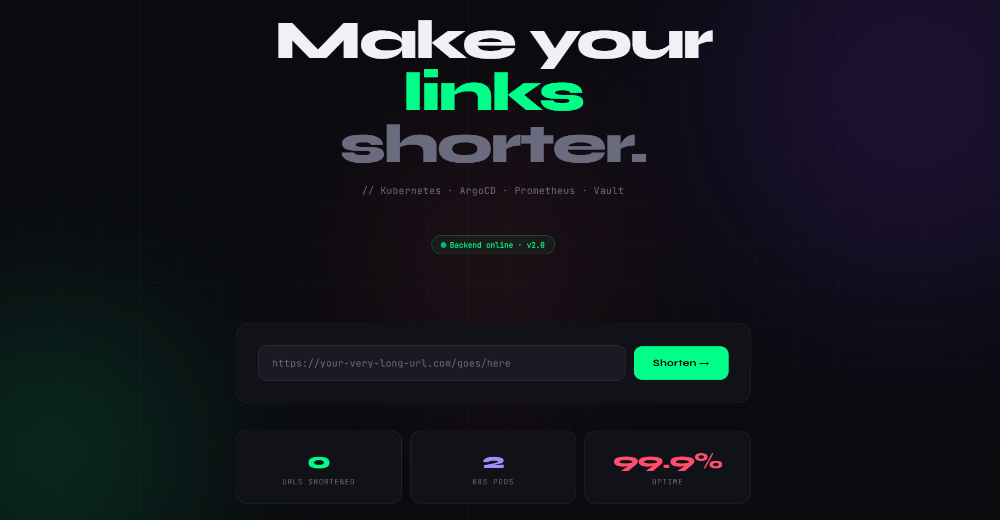

# URL Shortener — Production Grade DevOps Project

A fully containerized URL shortener application with a complete 
industry-grade DevOps pipeline built from scratch.

## Live Architecture

```
Developer → GitHub → GitHub Actions CI/CD → GHCR
                                          ↓
                              ArgoCD (GitOps) ← Helm Charts
                                          ↓
                              Kubernetes Cluster
                              ├── App Pods (Auto-scaled)
                              ├── Prometheus (Metrics)
                              ├── Grafana (Dashboards)
                              └── HashiCorp Vault (Secrets)
```

## Screenshots



## Tech Stack

| Category | Technology |
|----------|-----------|
| Application | Python, Flask |
| Containerization | Docker |
| Container Registry | GitHub Container Registry (GHCR) |
| CI/CD | GitHub Actions |
| Security Scanning | Bandit, Trivy, pip-audit |
| Orchestration | Kubernetes (Docker Desktop) |
| Package Manager | Helm |
| GitOps | ArgoCD |
| Monitoring | Prometheus + Grafana |
| Secrets Management | HashiCorp Vault |
| Infrastructure as Code | Terraform |
| Version Control | Git + GitHub |

## Security Features

- No hardcoded secrets anywhere in codebase
- Docker containers run as non-root user
- Automated vulnerability scanning on every push (Trivy)
- Static code security analysis (Bandit)
- Dependency vulnerability scanning (pip-audit)
- Secrets managed by HashiCorp Vault
- Least privilege RBAC policies
- Auto-expiring GitHub tokens (no long-lived credentials)
- SBOM (Software Bill of Materials) generated on every build

## CI/CD Pipeline

Every `git push` to main automatically triggers:

```
1. Run Tests
2. Scan code with Bandit (security)
3. Scan dependencies with pip-audit
4. Build Docker image
5. Scan image with Trivy (CVE scanning)
6. Push to GHCR with SBOM + provenance
7. ArgoCD detects new image
8. Auto-deploys to Kubernetes
```

## Project Structure

```
url-shortener-devops/
├── .github/
│   └── workflows/
│       └── ci-cd.yml          # GitHub Actions pipeline
├── helm-chart/                # Kubernetes packaging
│   ├── templates/
│   │   ├── deployment.yaml    # How to run the app
│   │   ├── service.yaml       # How to expose the app
│   │   └── hpa.yaml          # Auto-scaling config
│   └── values.yaml           # Configurable values
├── terraform/                 # Infrastructure as Code
│   ├── main.tf               # AWS provider config
│   ├── variables.tf          # Input variables
│   ├── vpc.tf                # Network config
│   ├── eks.tf                # Kubernetes cluster
│   └── outputs.tf            # Output values
├── argocd/
│   └── application.yaml      # GitOps config
├── prometheus-config/
│   └── servicemonitor.yaml   # Metrics scraping config
├── app.py                    # Flask application
├── Dockerfile                # Container definition
└── requirements.txt          # Python dependencies
```

## How to Run Locally

```bash
# Clone the repo
git clone https://github.com/prajwalbadigerrr/url-shortener-devops.git
cd url-shortener-devops

# Run with Docker
docker build -t url-shortener:v1.0 .
docker run -p 5000:5000 url-shortener:v1.0

# Test it
curl http://localhost:5000/health
curl -X POST http://localhost:5000/shorten \
  -H "Content-Type: application/json" \
  -d '{"url": "https://google.com"}'
```

## How to Deploy to Kubernetes

```bash
# Deploy using Helm
helm install url-shortener ./helm-chart

# Check status
kubectl get all

# Access the app
kubectl port-forward service/url-shortener-service 5000:5000
```

## Monitoring

Prometheus scrapes metrics from both app pods every 15 seconds.

Grafana dashboards available at `http://localhost:3000`:
- Request rate per second
- Response time (p50, p95, p99)
- Error rate
- Pod CPU and memory usage

## What I Learned

- How to build a secure CI/CD pipeline with multiple security gates
- How to deploy and manage applications on Kubernetes using Helm
- How to implement GitOps using ArgoCD — Git as single source of truth
- How to monitor applications using Prometheus and Grafana
- How to manage secrets securely using HashiCorp Vault
- How to write Infrastructure as Code using Terraform
- Security best practices — shift left security, least privilege, no hardcoded secrets

## Author

**Prajwal Badiger**  
DevOps Engineer  
[GitHub](https://github.com/prajwalbadigerrr)